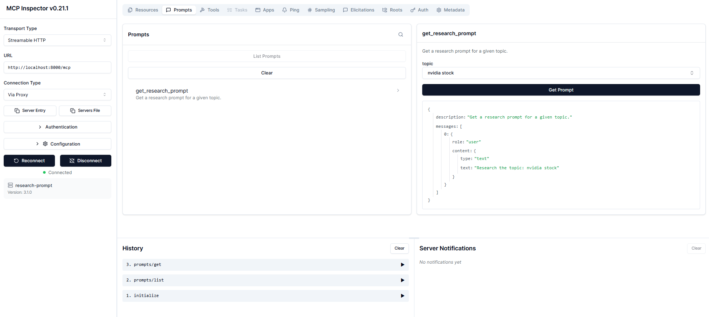

# CURSO MCP CRASH COURSE: CONTEXT MODEL PROTOCOL

## Basado en los siguientes recursos:
- https://github.com/emarco177/mcp-crash-course
- https://modelcontextprotocol.io/docs/getting-started/intro

## Sección 1: Introducción a MCP

## Sección 2:

1. Usar MCP Server existentes con Claude/VSCODE

https://github.com/modelcontextprotocol/quickstart-resources/tree/main/weather-server-typescript

## Sección 3 y 4:
Documentación dinámica usando llms.txt y llms_full.txt: https://github.com/langchain-ai/mcpdoc -> instalar MCP

crear entorno virtual, instalar dependencias y ejecutar:
Con el entorno activado:
```cmd
uvx --from mcpdoc mcpdoc --urls "LangGraph:https://langchain-ai.github.io/langgraph/llms.txt" "LangChain:https://python.langchain.com/llms.txt"  --transport sse --port 8082  --host localhost
```
En otra terminal (tener instalado npm):
```cmd
npx @modelcontextprotocol/inspector
```

Para agregar el MCP:
```json
{
  "mcpServers": {
    "langgraph-docs-mcp": {
      "command": "uvx",
      "args": [
        "--from",
        "mcpdoc",
        "mcpdoc",
        "--urls",
        "LangGraph:https://langchain-ai.github.io/langgraph/llms.txt LangChain:https://python.langchain.com/llms.txt",
        "--transport",
        "stdio"
      ]
    }
  }
}
```

## Sección 5: MCP para administrar archivos del pc

Configuración del entorno con uv:
```
uv init shellserver
uv venv
".venv\Scripts\activate"
uv add fastmcp
```
Agregar páginas a los docs de Cursor: https://github.com/modelcontextprotocol/python-sdk y https://modelcontextprotocol.io/
Crear carpeta .cursor rules con el archivo rules.md para las reglas de Cursor. y usar plantillas en https://cursor.directory/fastapi-python-cursor-rules

Para ejecutar el MCP server en Docker, dentro de la carpeta de shellserver se crea el Dockerfile y se ejecuta:
```
docker build -t shellserver-app .
docker run -it --rm shellserver-app
```
**Hasta ahora el JSON de Claude corría todo este MCP Server con uv:**
```json
{
  "mcpServers": {
    "weather": {
      "command": "uv",
      "args": [
        "--directory",
        "C:\\Users\\lftob\\Documents\\PROYECTOS_ESTUDIO\\ML_Engineer\\MCP_Udemy\\quickstart-resources\\weather-server-python",
        "run",
        "weather.py"
      ]
    },
    "langgraph-docs-mcp": {
      "command": "uvx",
      "args": [
        "--from",
        "C:\\Users\\lftob\\Documents\\PROYECTOS_ESTUDIO\\ML_Engineer\\MCP_Udemy\\mcpdoc",
        "mcpdoc",
        "--urls",
        "LangGraph:https://langchain-ai.github.io/langgraph/llms.txt LangChain:https://python.langchain.com/llms.txt",
        "--transport",
        "stdio"
      ]
    },
    "shell": {
      "command": "uv",
      "args": [
        "--directory",
        "C:\\Users\\lftob\\Documents\\PROYECTOS_ESTUDIO\\ML_Engineer\\MCP_Udemy\\MCP_Crash_Course_Udemy\\05-seccion_MCP_local\\shellserver",
        "run",
        "server.py"
      ]
    }
  },
  "preferences": {
    "coworkWebSearchEnabled": true,
    "coworkScheduledTasksEnabled": false,
    "ccdScheduledTasksEnabled": false,
    "sidebarMode": "chat"
  }
}
```

**Pero para que se pueda ejecutar usando el contenedor de Docker:**
```json
    },    
    "docker-shell": {
      "command": "docker",
      "args": [
        "run",
        "-i",
        "--rm",
        "--init",
        "-e",
        "DOCKER_CONTAINER=true",
        "shellserver-app"
      ]
    }
```

Completo hasta sección 5:
```json
{
  "mcpServers": {
    "weather": {
      "command": "uv",
      "args": [
        "--directory",
        "C:\\Users\\lftob\\Documents\\PROYECTOS_ESTUDIO\\ML_Engineer\\MCP_Udemy\\quickstart-resources\\weather-server-python",
        "run",
        "weather.py"
      ]
    },
    "langgraph-docs-mcp": {
      "command": "uvx",
      "args": [
        "--from",
        "C:\\Users\\lftob\\Documents\\PROYECTOS_ESTUDIO\\ML_Engineer\\MCP_Udemy\\mcpdoc",
        "mcpdoc",
        "--urls",
        "LangGraph:https://langchain-ai.github.io/langgraph/llms.txt LangChain:https://python.langchain.com/llms.txt",
        "--transport",
        "stdio"
      ]
    },
    "shell": {
      "command": "uv",
      "args": [
        "--directory",
        "C:\\Users\\lftob\\Documents\\PROYECTOS_ESTUDIO\\ML_Engineer\\MCP_Udemy\\MCP_Crash_Course_Udemy\\05-seccion_MCP_local\\shellserver",
        "run",
        "server.py"
      ]
    },    
    "docker-shell": {
      "command": "docker",
      "args": [
        "run",
        "-i",
        "--rm",
        "--init",
        "-e",
        "DOCKER_CONTAINER=true",
        "shellserver-app"
      ]
    }
  },
  "preferences": {
    "coworkWebSearchEnabled": true,
    "coworkScheduledTasksEnabled": false,
    "ccdScheduledTasksEnabled": false,
    "sidebarMode": "chat"
  }
}
```

## Sección 6: Conexión con clientes LLM - "tool calling mechanisms" y MCP

### 1. Práctica: langchain + MCP Adapters

https://github.com/langchain-ai/langchain-mcp-adapters

Crear nuevamente la carpeta del proyecto, iniciar uv init, crear entorno con uv venv, activar y configurar:
```
uv add python-dotenv langchain langchain-mcp-adapters langgraph langchain-google-genai langchain-ollama isort rich
```
Para hacer tracing se deben usar las variables de entorno para el proyecto en LangSmith (se necesita que el entorno sea python >= 3.11):
```
LANGSMITH_TRACING=true
LANGSMITH_ENDPOINT=https://api.smith.langchain.com
LANGSMITH_API_KEY=aqui_va_la_api_key
LANGSMITH_PROJECT="nombre_del_proyecto_creado_en_langsmith"
```

```
uv add langgraph-cli --dev
uv add "langgraph-cli[inmem]" --dev
```
## Sección 7: Prompts y Resources

### 1. Práctica Prompts

https://github.com/emarco177/mcp-crash-course/tree/project/prompts

Crear nuevamente la carpeta del proyecto, iniciar uv init, crear entorno con uv venv, activar y configurar:
```
uv add fastmcp
```
Luego de tener el main.py, se configura en Claude (solo sirve con transport STDIO):
```
,
    "research-prompt-mcp": {
      "command": "c:\\Users\\lftob\\Documents\\PROYECTOS_ESTUDIO\\ML_Engineer\\MCP_Udemy\\MCP_Crash_Course_Udemy\\07-seccion_prompts\\prompts\\.venv\\Scripts\\python.exe",
      "args": ["C:\\Users\\lftob\\Documents\\PROYECTOS_ESTUDIO\\ML_Engineer\\MCP_Udemy\\MCP_Crash_Course_Udemy\\07-seccion_prompts\\prompts\\main.py"]
    }
```
Probar desde MCP Inspector con transport HTTP:
Ejecuta el main.py de prompt con el transport en HTTP y luego en otra terminal el MCP inspector:
```
uv run main.py
npx @modelcontextprotocol/inspector
```



## Configuración del entorno:

Configuración:
```
uv init
uv venv
".venv/Scripts/activate"
uv pip install torch torchvision --index-url https://download.pytorch.org/whl/cu121
uv add ipykernel --dev
uv add grandalf --dev
uv add fastapi[standard]
uv add langgraph-checkpoint-postgres
uv add psycopg psycopg-binary
uv add langchain langgraph langchain-community langchain-google-genai langchain-ollama langchain-experimental langchain-openai python-dotenv pypdf chromadb langchain-chroma  "onnxruntime==1.19.2" Jinja2 
```

También se necesatia el debugger propio de LangGraph, que puede ser instalado con ("--dev" indica que es una dependencia de desarrollo, no necesaria para producción):
```
uv add langgraph-cli --dev
uv add "langgraph-cli[inmem]" --dev
```

Lo que se haya instalado con uv add se reflejará en el archivo pyproject.toml, y lo que se haya instalado con uv pip install no. ```uv pip install -e```

Se debe crear un archivo de configuración *"langgraph.json"*.

**PARA FEBRERO DE 2026 AHORA LA VISUALIZACIÓN YA NO ES OPENSOURCE - ES CON LANGSMITH Y CUESTA**

1. *Crear cuenta en langsmith:*

2. *Crear API de LangSmith*:

3. Colocar la API Key en el archivo .env:
```LANGSMITH_API_KEY=sk-xxxxxx```

Ejecutar ```langgraph dev``` o con ```uv run langgraph dev```


## Clase 3: Ajuste de estructura del proyecto para uso de varios agentes

```
notebooks/
    notebook.ipynb
src/
    agents/
        __init__.py
        main.py
    api/
        __init__.py        
```
En el .toml se debe indicar que los paquetes se encuentran en la carpeta src, y que se deben incluir todos los archivos:

```[tool.setupstools.packages.find]
where = ["src"]
include = ["*"]
```

Para aplicar los cambios, se debe ejecutar ```uv pip install -e .```

Para ejecutar con fastapi se debe iniciar el contenedor docker con docker compose, con el comando:
```docker compose up
```

Luego lanzar con fastapi dev ruta/al/src/api/main.py

```uv run fastapi dev src/api/main.py```